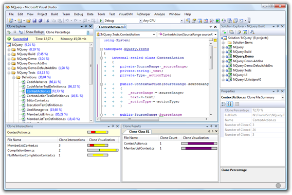

## Welcome to Clone Detective for Visual Studio!
Clone Detective is a Visual Studio integration that allows you to analyze C# projects for source code that is duplicated somewhere else. Having duplicates can easily lead to inconsistencies and often is an indicator for poorly factored code.

For more details please see the [Videos](Videos) page.

**Interested in maintaining this project?** The current maintainers no longer have the time to properly suppport this project. If you're interested, [contact us](https://www.codeplex.com/site/users/contact/dallmair?OriginalUrl=https%3a%2f%2fwww.codeplex.com%2fsite%2fusers%2fview%2fdallmair).

Clone Detective uses [ConQAT](http://conqat.cs.tum.edu) to perform the clone detection.

